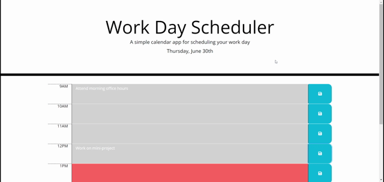

# Work Day Scheduler

A simple application to keep track of daily work day events, which are saved in local storage and are reset every day. 

## Description

This web application uses moment.js to dynamically display the current day and a daily work day schedule colored to indicate past present and future events. The user can enter events into each hour block and save them to local storage, which persists until the end of the day.

## Installation

Upload all files or fork from the repository to your server or deploy on Github Pages. The website linked below is deployed using Github Pages.

## Usage

Link to deployed site: https://seannoh.github.io/work-day-scheduler/  

Type text into corresponding hour block and click the save button to save it. 

### Preview



## Technologies Used

- HTML
- CSS
- [JavaScript](www.javascript.com)
- [jQuery](https://jquery.com/)
- [PopperJS](https://popper.js.org/)
- [Bootstrap](https://getbootstrap.com/)
- [Moment.js](https://momentjs.com/)
- [Font Awesome](https://fontawesome.com/)
- [Google Fonts](https://fonts.google.com/)

## Code Snippets

This code snippet describes how I implemented a fading popover for the save buttons which notify the user that their event is saved. I used Bootstrap popovers, which use PopperJS. Since the save buttons are created dynamically, the popovers must be created in a separate js statement. I used the setTimeout method to set a timer for when the popver should hide and the "delay" modifier in the popover method to add a fade-in and fade-out.

<details>
<summary>Click to see code snippet of popover functionality</summary>

```
// add popover functionality to save buttons
    $('button').popover({
      content: "Saved",
      delay: {"show":100, "hide":100}
    })
    $('button').on("click", function () {
    
      setTimeout(function () {
          $('button').popover("hide");
      }, 1000);
    
    });
```
</details>
<br>

## Credits

This application was built with the support of the resources and staff of the UCB Full Stack Full Time Coding Bootcamp Summer 2022.

### References Used

- https://getbootstrap.com/docs/4.0/components/popovers/#usage
- https://stackoverflow.com/questions/31453279/how-to-fade-out-a-bootstrap-popover-after-5-seconds
- https://momentjs.com/docs

## Author

This project was created by Sean Oh. 
- [Github](https://github.com/seannoh)
- [Linkedin](https://www.linkedin.com/in/sean-oh-bb9781241/)
- [Portfolio](https://seannoh.github.io/portfolio)

## License

<details>
<summary>MIT License</summary>

MIT License

Copyright (c) 2022 Sean Oh

Permission is hereby granted, free of charge, to any person obtaining a copy
of this software and associated documentation files (the "Software"), to deal
in the Software without restriction, including without limitation the rights
to use, copy, modify, merge, publish, distribute, sublicense, and/or sell
copies of the Software, and to permit persons to whom the Software is
furnished to do so, subject to the following conditions:

The above copyright notice and this permission notice shall be included in all
copies or substantial portions of the Software.

THE SOFTWARE IS PROVIDED "AS IS", WITHOUT WARRANTY OF ANY KIND, EXPRESS OR
IMPLIED, INCLUDING BUT NOT LIMITED TO THE WARRANTIES OF MERCHANTABILITY,
FITNESS FOR A PARTICULAR PURPOSE AND NONINFRINGEMENT. IN NO EVENT SHALL THE
AUTHORS OR COPYRIGHT HOLDERS BE LIABLE FOR ANY CLAIM, DAMAGES OR OTHER
LIABILITY, WHETHER IN AN ACTION OF CONTRACT, TORT OR OTHERWISE, ARISING FROM,
OUT OF OR IN CONNECTION WITH THE SOFTWARE OR THE USE OR OTHER DEALINGS IN THE
SOFTWARE.

</details>